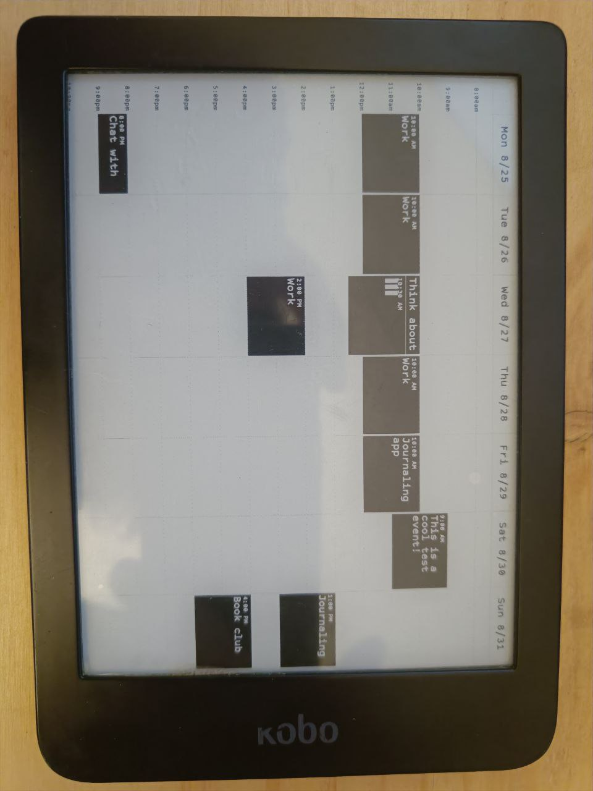

# TRMNL Plugin Provider

A plugin-based image generation system for TRMNL devices that connects to a BYOS (Bring Your Own Server) [Hanami backend](https://github.com/usetrmnl/byos_hanami/tree/main).

## Demo

Example of the `calendar` plugin on a Kobo Clara HD :


## Overview

The objective of this project is to replace the trmnl-core prioritary project.

TRMNL Plugin Provider automatically discovers the first available device and runs configured plugins at regular intervals to generate images and send them to your TRMNL display. Each plugin creates visual content using HTML5 Canvas and uploads it to the server for display on your device.

## Quick Start

### Prerequisites

- Node.js (with TypeScript support)
- A running BYOS Hanami server
- TRMNL device configured on your server

### Installation

```bash
yarn install
```

### Configuration

Create a `.env` file with your server details:

```env
TERMINUS_URL=your-server-hostname
TERMINUS_PORT=your-server-port
```

### Running

```bash
yarn start
```

## Docker

### Using Docker Compose (Recommended)

The easiest way to run TRMNL Plugin Provider is using Docker Compose:

```bash
# Build and start the container
docker-compose up -d

# View logs
docker-compose logs -f

# Stop the container
docker-compose down
```

### Using Docker directly

```bash
# Build the image
docker build -t trmnl-plugin-provider .

# Run the container
docker run -d --name trmnl-plugin-provider trmnl-plugin-provider
```

### Docker Requirements

- Ensure your `.env` file is present in the project root before building
- The container uses Bun runtime for optimal performance
- The container runs with restart policy `always` for production deployments

### Docker Environment

The Docker setup:
- Uses the official Bun runtime image for fast TypeScript execution
- Copies fonts, source code, and environment configuration
- Automatically installs dependencies during build
- Runs the application with `bun src/index.ts`

## Plugin System

### Creating a Plugin

1. Create a new directory in `src/plugins/` (e.g., `src/plugins/weather/`)
2. Add an `index.ts` file that exports a default class extending `BasePlugin`
3. Add a `config.json` file with plugin configuration

#### Example Plugin Structure

```
src/plugins/weather/
├── index.ts
├── config.json
└── config.example.json
```

#### Plugin Implementation

```typescript
import { BasePlugin } from "../basePlugin";

export class WeatherPlugin extends BasePlugin<{
  apiKey: string;
  location: string;
}> {
  async onStart(): Promise<void> {
    this.log("Weather plugin started", "info");
  }

  protected async draw(): Promise<void> {
    // Use this.ctx to draw on the canvas
    this.ctx.fillStyle = "#000000";
    this.ctx.font = "24px Arial";
    this.ctx.fillText("Hello World", 50, 50);
  }
}

export default WeatherPlugin;
```

#### Plugin Configuration

```json
{
  "enabled": true,
  "config": {
    "apiKey": "your-api-key",
    "location": "New York, NY"
  }
}
```

### Configuration Options

- `enabled`: Whether the plugin should run
- `config`: Plugin-specific configuration object

**Note**: Plugin refresh is now synchronized with your device's refresh schedule. All plugins refresh automatically 1 minute before the device is scheduled to refresh, ensuring optimal coordination.

### Available Plugins

#### Calendar Plugin
Displays Google Calendar events in a week view format.

**Setup:**
1. Copy `src/plugins/calendar/config.example.json` to `src/plugins/calendar/config.json`
2. Add your Google Service Account credentials
3. Configure calendar ID and display preferences

#### Example Plugin
A basic template plugin for development reference.

## BasePlugin API

### Properties
- `canvas`: HTML5 Canvas instance
- `ctx`: 2D rendering context
- `screenWidth`/`screenHeight`: Display dimensions
- `pluginName`: Plugin identifier
- `config`: Plugin configuration object
- `deviceInfo`: TRMNL device information

### Methods
- `draw()`: Abstract method for rendering content (implement in your plugin)
- `onStart()`: Lifecycle hook called when plugin initializes
- `renderToBase64()`: Converts canvas to base64 image data
- `log(message, level)`: Logging with plugin prefix
- `drawError(error)`: Error handling and display

### Available Fonts
- Arial
- VT323 (monospace)
- Courier
- Roboto

## Architecture

```
┌─────────────────┐    ┌──────────────────┐    ┌─────────────────┐
│   Plugin Loop   │───▶│   Base Plugin    │───▶│  TRMNL Device   │
└─────────────────┘    └──────────────────┘    └─────────────────┘
         │                       │                       │
         ▼                       ▼                       ▼
┌─────────────────┐    ┌──────────────────┐    ┌─────────────────┐
│ Plugin Discovery│    │ Canvas Rendering │    │  BYOS Server    │
└─────────────────┘    └──────────────────┘    └─────────────────┘
```

### Key Components

- **PluginLoop**: Discovers and manages plugin lifecycle
- **BasePlugin**: Abstract class providing Canvas API and utilities
- **Terminus API**: Handles communication with BYOS server
- **Device Management**: Automatically configures screen dimensions based on device model

## Development

### Project Structure

```
src/
├── index.ts              # Application entry point
├── pluginloop.ts         # Plugin discovery and management
├── env.ts                # Environment configuration
├── terminus.ts           # BYOS server API client
└── plugins/
    ├── basePlugin.ts     # Abstract plugin base class
    ├── example/          # Example plugin template
    └── calendar/         # Google Calendar plugin
```

### Testing

```bash
yarn test
```

### Building

```bash
yarn build
```

## Environment Variables

| Variable | Description | Required |
|----------|-------------|----------|
| `TERMINUS_URL` | BYOS server hostname | Yes |
| `TERMINUS_PORT` | BYOS server port | Yes |

## API Reference

### Terminus API Methods

- `getDevice(id)`: Retrieve device information
- `getModel(id)`: Get device model specifications
- `getScreens()`: List all screens
- `addScreen(base64, name, label, filename, modelId)`: Upload new screen
- `removeScreen(id)`: Delete screen
- `addScreenToPlaylist(playlistId, screenId)`: Add screen to playlist
- `removeScreenFromPlaylist(playlistId, screenId)`: Remove from playlist

## License

MIT
